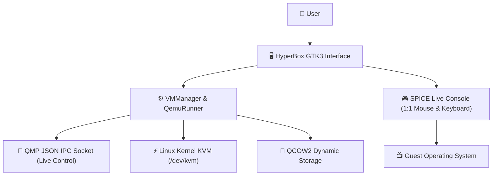

# 🚀 HyperBox

<div align="center">
  
  <h3>Fast, Modern and Lightweight Virtual Machine Manager for Linux</h3>
  <p><i>VirtualBox Ease of Use + Native Linux Kernel KVM/QEMU Performance</i></p>

  <p align="center">
    <b>Language / Dil Seçimi:</b><br />
    <a href="README.md">🇬🇧 <b>English</b></a> &nbsp;|&nbsp;
    <a href="README.tr.md">🇹🇷 <b>Türkçe</b></a>
  </p>

  [-blue?logo=linux&logoColor=white)](#-supported-distributions-and-dependencies)
  [](https://www.python.org/)
  [](https://www.gtk.org/)
  [](https://www.qemu.org/)
  [](#-advanced-live-console)
  [](LICENSE)
</div>

---

## 📖 Overview

**HyperBox** is a modern desktop virtualization application tailored for Linux users. It pairs an intuitive, VirtualBox-style graphical user interface (GUI) with the raw hardware acceleration of the Linux kernel's **KVM (`/dev/kvm`)** and **QEMU**.

Enjoy near bare-metal virtualization speeds without cumbersome VirtualBox kernel module (`vboxdrv`) compilation failures or out-of-tree DKMS breakages during kernel updates.



---

## ✨ Features

- **🎨 VirtualBox-Style User Interface:**
  - Left panel: Virtual machine catalog with OS icons and real-time state badges (🟢 Running, 🔴 Stopped, 🟡 Paused).
  - Right panel: System, Display, Storage, Network breakdowns and live QEMU output logs.
  - Real-time search filter bar.

- **🧙 New VM Wizard:**
  - **Mandatory ISO Validation:** Prevents creating or launching unbootable VMs by enforcing ISO selection.
  - **Auto OS Detection:** Automatically recognizes the guest operating system (Ubuntu, Arch, Debian, Fedora, Windows 10/11, etc.) from the ISO filename and presets recommended RAM, CPU cores, and Disk capacity.
  - **Dynamic Storage:** Creates dynamically expanding `qcow2` virtual disks.

- **🎮 Advanced Live Console:**
  - **Smooth Mouse & Keyboard:** Absolute pointer input via `-device usb-tablet` and `-device usb-kbd` ensures seamless pointer movement without locking or trapping the cursor under Wayland and X11.
  - **Boot Menu Helpers:** Dedicated non-focus-stealing **"Send Enter"** and **"Down Arrow"** buttons to navigate GRUB/Syslinux menus without keypress loss.
  - **System Controls:** Pause, Reset, Graceful Shutdown (ACPI), Force Power Off, and **Send Ctrl+Alt+Del**.
  - **Dual Display Modes:** Built-in embedded SPICE client or 1-click external window using `virt-viewer` (remote-viewer).

- **🔊 Automated Audio Architecture:**
  - Dynamically discovers the host sound server (`PipeWire`, `PulseAudio`, or `ALSA`) and passes a compatible Intel HDA sound device to the guest.

- **🛡️ Self-Healing Virtual Disks:**
  - Automatically identifies raw or corrupted disk headers at startup and converts them safely to QCOW2 format.

---

## 📊 Comparison

| Feature | HyperBox | VirtualBox | Virt-Manager |
| :--- | :---: | :---: | :---: |
| **Virtualization Engine** | KVM / QEMU (Native Kernel) | VBoxDrv (Out-of-tree Kernel Module) | KVM / libvirt |
| **Interface Complexity** | Simple & Intuitive | Familiar & Simple | Complex / Enterprise |
| **User Permission Needed** | Standard User (`/dev/kvm`) | Root / Vboxusers | Libvirt Daemon / Root |
| **Wayland & KDE Support** | 100% Native & Tested | Pointer Capture Issues | Supported |
| **Mandatory ISO Guard** | Enforced ✔ | Optional (Can boot empty) | Optional |
| **Disk Format** | Standard QCOW2 (Compressible) | VDI (Proprietary) | QCOW2 / Raw |

---

## 📦 Supported Distributions and Dependencies

HyperBox automatically detects your Linux distribution and can install missing packages with a single click. You can also install them manually via your package manager:

### 1. Arch Linux / CachyOS / Manjaro / EndeavourOS
```bash
sudo pacman -S --needed qemu-desktop qemu-img virt-viewer python-gobject
```

### 2. Ubuntu / Debian / Linux Mint / Pop!_OS
```bash
sudo apt-get update
sudo apt-get install -y qemu-system-x86 qemu-utils virt-viewer python3-gi gir1.2-spiceclientgtk-3.0 gir1.2-gtk-3.0
```

### 3. Fedora / RHEL / AlmaLinux / Rocky Linux
```bash
sudo dnf install -y qemu-kvm qemu-img virt-viewer python3-gobject spice-gtk3
```

### 4. openSUSE (Tumbleweed & Leap)
```bash
sudo zypper install -y qemu-x86 qemu-tools virt-viewer python3-gobject typelib-SpiceClientGtk
```

---

## 🚀 Installation

Clone the repository and run the setup script:

```bash
git clone https://github.com/il4pt/HyperBox.git
cd HyperBox
chmod +x install.sh
./install.sh
```

The `install.sh` script automatically:
1. Installs vector icons to `~/.local/share/icons/hicolor/`.
2. Adds a desktop shortcut to your Desktop.
3. Registers HyperBox in your application menu (launcher).
4. Creates a `hyperbox` command in `~/.local/bin/` for quick terminal execution.

### Launching the Application
- **From Desktop:** Double-click the **HyperBox** desktop shortcut.
- **From Menu:** Search for **HyperBox** in your desktop environment's launcher.
- **From Terminal:**
  ```bash
  hyperbox
  # Or
  ./launch.sh
  ```

---

## 🗑️ Uninstallation

To remove HyperBox and its shortcuts:
```bash
./uninstall.sh
```
*(Note: Your virtual machines and disk images located in `~/.local/share/hyperbox/` are preserved safely).*

---

## 📁 Project Structure

```
HyperBox/
├── assets/                  # SVG and PNG brand icons
├── hyperbox/
│   ├── config.py            # Paths, constants, and KVM detection
│   ├── distro.py            # Linux distribution and package manager detection
│   ├── models.py            # VM, Disk, and Network data structures
│   ├── qemu_runner.py       # QEMU process lifecycle, QMP socket, and CLI builder
│   ├── storage.py           # QCOW2 virtual disk generator and inspection
│   ├── vm_manager.py        # Central VM repository and state persistence
│   └── ui/
│       ├── main_window.py       # VirtualBox-style main window with search filter
│       ├── new_vm_wizard.py     # Mandatory ISO wizard with auto OS detection
│       ├── settings_dialog.py   # CPU, RAM, Display, and Network configuration
│       ├── console_window.py    # Embedded SPICE console and boot helpers
│       └── dependency_dialog.py # Distribution-aware package installer dialog
├── install.sh               # Universal installer script
├── uninstall.sh             # Clean uninstaller script
├── launch.sh                # Desktop entry launcher
├── main.py                  # Entry point
├── .gitignore               # Ignored build, disk, and ISO artifacts
├── LICENSE                  # GNU GPLv3 License
├── README.tr.md             # Turkish Documentation
└── README.md                # English Documentation (Default)
```

---

## ⌨️ Keyboard Shortcuts & Console Helpers

| Shortcut / Button | Function |
| :--- | :--- |
| `F11` | Toggle Fullscreen on the Live Console |
| `Ctrl + Alt + Del` | Dedicated toolbar button sends ACPI reboot signal |
| `Send Enter` | Sends an Enter keycode directly to the guest boot menu |
| `Down Arrow` | Sends a Down Arrow keycode to select alternative boot entries |

---

## ❓ Frequently Asked Questions (FAQ)

### Q: I get an error saying KVM hardware acceleration is not active. What should I do?
Enable **Intel VT-x** or **AMD-V (SVM)** in your BIOS/UEFI settings. Next, add your user to the `kvm` group:
```bash
sudo usermod -aG kvm $USER
```
Log out and log back in for the group membership to take effect.

### Q: How do I release the mouse pointer from the virtual machine?
HyperBox employs the `-device usb-tablet` absolute coordinate driver. Your cursor will not be trapped inside the VM window; simply move your mouse outside the console window naturally.

---

## 📜 License

This project is licensed under the [GNU General Public License v3.0](LICENSE). You are free to use, modify, and redistribute it.
