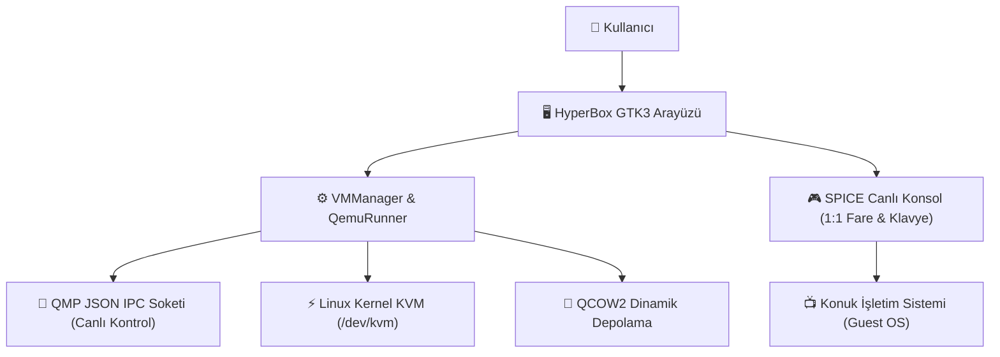

# 🚀 HyperBox

<div align="center">
  
  <h3>Linux için Hızlı, Modern ve Hafif Sanal Makine Yöneticisi</h3>
  <p><i>VirtualBox Kullanım Kolaylığı + Linux Çekirdeğinin Yerel KVM/QEMU Performansı</i></p>

  <p align="center">
    <b>Dil Seçimi / Language:</b><br />
    <a href="README.md">🇬🇧 <b>English</b></a> &nbsp;|&nbsp;
    <a href="README.tr.md">🇹🇷 <b>Türkçe</b></a>
  </p>

  [-blue?logo=linux&logoColor=white)](#-desteklenen-da%C4%9F%C4%B1t%C4%B1mlar-ve-ba%C4%9F%C4%B1ml%C4%B1l%C4%B1klar)
  [](https://www.python.org/)
  [](https://www.gtk.org/)
  [](https://www.qemu.org/)
  [](#-geli%C5%9Fmi%C5%9F-canl%C4%B1-konsol-live-console)
  [](LICENSE)
</div>

---

## 📖 Genel Bakış (Overview)

**HyperBox**, Linux kullanıcıları için VirtualBox benzeri sezgisel bir grafik kullanıcı arayüzü (GUI) ile Linux çekirdeğinin doğrudan donanım sanallaştırma motoru olan **KVM (`/dev/kvm`)** ve **QEMU**'yu birleştiren modern bir masaüstü sanallaştırma uygulamasıdır.

VirtualBox'ın hantal çekirdek modülü (`vboxdrv`) bağımlılıkları ve her çekirdek güncellemesinde yaşanan derleme sorunları olmadan, Linux'un yerel sanallaştırma hızından yararlanır.



---

## ✨ Özellikler (Features)

- **🎨 VirtualBox Tarzı Arayüz:**
  - Sol panelde sanal makinelerin listesi, işletim sistemi simgeleri ve anlık çalışma rozetleri (🟢 Çalışıyor, 🔴 Kapalı, 🟡 Duraklatıldı).
  - Sağ panelde Sistem, Ekran, Depolama, Ağ özetleri ve canlı QEMU logları.
  - Hızlı arama ve filtreleme çubuğu.

- **🧙 Yeni Sanal Makine Sihirbazı (New VM Wizard):**
  - **Zorunlu ISO Doğrulaması:** ISO seçilmeden makine oluşturulmasını engelleyerek hatalı önyükleme riskini önler.
  - **Otomatik Dağıtım Tespiti:** Seçilen ISO dosya adından işletim sistemini tanır (Ubuntu, Arch, Debian, Fedora, Windows 10/11 vb.) ve önerilen RAM/CPU/Disk değerlerini otomatik ayarlar.
  - **Dinamik Disk:** Dinamik büyüyen `qcow2` formatında disk oluşturma.

- **🎮 Gelişmiş Canlı Konsol (Live Console):**
  - **Kusursuz Fare ve Klavye:** `-device usb-tablet` ve `-device usb-kbd` ile Wayland/X11 üzerinde kilitlenmeyen 1:1 hassas imleç etkileşimi.
  - **Boot Menüsü Kısayolları:** GRUB ve Syslinux boot menülerinde takılmayı önleyen **"Enter Gönder"** ve **"Aşağı Ok"** butonları.
  - **Sistem Kontrolleri:** Duraklatma, Sıfırlama (Reset), Zarif Kapatma (ACPI), Güç Kesme ve **Ctrl+Alt+Del Gönder**.
  - **Çoklu Görüntü Modu:** Entegre SPICE ekranı veya tek tıkla `virt-viewer` (remote-viewer) harici pencere desteği.

- **🔊 Otomatik Ses Desteği:**
  - Ana makinedeki ses sunucusunu (`PipeWire`, `PulseAudio` veya `ALSA`) otomatik tespit ederek konuk sisteme Intel HDA ses kartı bağlar.

- **🛡️ Kendi Kendini Onaran Diskler (Self-Healing Storage):**
  - Bozuk veya ham (raw) formatta kalmış diskleri başlatma anında tespit edip otomatik olarak QCOW2 formatına dönüştürür.

---

## 📊 Karşılaştırma (Comparison)

| Özellik | HyperBox | VirtualBox | Virt-Manager |
| :--- | :---: | :---: | :---: |
| **Sanallaştırma Motoru** | KVM / QEMU (Yerel Çekirdek) | VBoxDrv (Harici Modül) | KVM / libvirt |
| **Arayüz Karmaşıklığı** | Kolay & Sezgisel | Kolay | Karmaşık / Kurumsal |
| **Kullanıcı İzni Gereksinimi** | Normal Kullanıcı (`/dev/kvm`) | Root / Vboxusers | Libvirt / Root erişimi |
| **Wayland & KDE Uyumluluğu** | %100 Uyumlu | Sorunlu fare yakalama | Uyumlu |
| **Zorunlu ISO Koruması** | Var ✔ | Yok (Boş açılabilir) | Yok |
| **Disk Formatı** | Standart QCOW2 (Sıkıştırılabilir) | VDI (Özel format) | QCOW2 / Raw |

---

## 📦 Desteklenen Dağıtımlar ve Bağımlılıklar

HyperBox, çalıştığı dağıtımı otomatik tespit ederek eksik bağımlılıkları tek tıkla kurabilir. Dilerseniz terminalden de aşağıdaki komutlarla kurabilirsiniz:

### 1. Arch Linux / CachyOS / Manjaro / EndeavourOS
```bash
sudo pacman -S --needed qemu-desktop qemu-img virt-viewer python-gobject
```

### 2. Ubuntu / Debian / Linux Mint / Pop!_OS
```bash
sudo apt-get update
sudo apt-get install -y qemu-system-x86 qemu-utils virt-viewer python3-gi gir1.2-spiceclientgtk-3.0 gir1.2-gtk-3.0
```

### 3. Fedora / RHEL / AlmaLinux / Rocky Linux
```bash
sudo dnf install -y qemu-kvm qemu-img virt-viewer python3-gobject spice-gtk3
```

### 4. openSUSE (Tumbleweed & Leap)
```bash
sudo zypper install -y qemu-x86 qemu-tools virt-viewer python3-gobject typelib-SpiceClientGtk
```

---

## 🚀 Kurulum (Installation)

Depoyu klonlayıp tek komutla kurulumu tamamlayabilirsiniz:

```bash
git clone https://github.com/il4pt/HyperBox.git
cd HyperBox
chmod +x install.sh
./install.sh
```

`install.sh` betiği otomatik olarak:
1. Uygulama ikonlarını `~/.local/share/icons/hicolor/` altına yükler.
2. Masaüstünüze `HyperBox.desktop` kısayolu oluşturur.
3. Uygulama menünüze (Başlat menüsü) HyperBox'ı ekler.
4. Terminalden doğrudan `hyperbox` komutuyla açabilmeniz için kısayol tanımlar.

### Uygulamayı Başlatma
- **Masaüstünden:** Masaüstündeki **HyperBox** simgesine çift tıklayın.
- **Menüden:** Uygulama listenizden **HyperBox**'ı seçin.
- **Terminalden:**
  ```bash
  hyperbox
  # Veya
  ./launch.sh
  ```

---

## 🗑️ Kaldırma (Uninstallation)

Uygulamayı ve kısayollarını kaldırmak isterseniz:
```bash
./uninstall.sh
```
*(Not: Oluşturduğunuz sanal makineler ve disk dosyalarınız `~/.local/share/hyperbox/` altında güvende tutulur).*

---

## 📁 Proje Mimarisi

```
HyperBox/
├── assets/                  # SVG ve PNG uygulama logoları
├── hyperbox/
│   ├── config.py            # Yollar, sabitler ve KVM tespit fonksiyonları
│   ├── distro.py            # Linux dağıtım & paket yöneticisi tespiti
│   ├── models.py            # Sanal makine, disk ve ağ veri modelleri
│   ├── qemu_runner.py       # QEMU süreç yönetimi, QMP soketi ve donanım argümanları
│   ├── storage.py           # QCOW2 sanal disk oluşturucu ve disk bilgisi
│   ├── vm_manager.py        # VM merkezi kayıt defteri ve durum sorgusu
│   └── ui/
│       ├── main_window.py       # VirtualBox tarzı ana pencere ve canlı filtreleme
│       ├── new_vm_wizard.py     # Zorunlu ISO'lu Sanal Makine Sihirbazı
│       ├── settings_dialog.py   # Donanım, CPU, RAM, Ekran ve Ağ ayarları
│       ├── console_window.py    # SPICE canlı ekran konsolu & boot tuşları
│       └── dependency_dialog.py # Dağıtıma özel bağımlılık yükleme penceresi
├── install.sh               # Evrensel kurulum betiği
├── uninstall.sh             # Temiz kaldırma betiği
├── launch.sh                # Masaüstü başlatıcı betiği
├── main.py                  # Ana giriş noktası
├── .gitignore               # Git dışlama kuralları
├── LICENSE                  # GNU GPLv3 Lisansı
├── README.tr.md             # Türkçe Dokümantasyon
└── README.md                # İngilizce Dokümantasyon (Default)
```

---

## ⌨️ Klavye Kısayolları

| Kısayol | İşlev |
| :--- | :--- |
| `F11` | Canlı Ekran Konsolunu Tam Ekran moduna alır / çıkar |
| `Ctrl + Alt + Del` | Konsoldaki butonla sanal makineye doğrudan gönderilir |
| `Enter Gönder` | Konsol araç çubuğundan Boot menüsü için doğrudan Enter gönderir |
| `Aşağı Ok` | Konsol araç çubuğundan Boot menüsünde alt seçeneğe geçer |

---

## ❓ Sıkça Sorulan Sorular (FAQ)

### S: KVM donanım hızlandırma aktif değil hatası alıyorum, ne yapmalıyım?
BIOS/UEFI ayarlarınızdan **Intel VT-x** veya **AMD-V (SVM)** sanallaştırma desteğini etkinleştirin. Ardından kullanıcınızı `kvm` grubuna ekleyin:
```bash
sudo usermod -aG kvm $USER
```

### S: Sanal makineden fare imlecini nasıl kurtarırım?
HyperBox, `-device usb-tablet` mutlak koordinat sürücüsünü kullandığı için imleciniz sanal makine penceresine hapsolmaz; farenizi doğrudan pencerenin dışına kaydırabilirsiniz.

---

## 📜 Lisans (License)

Bu proje [GNU General Public License v3.0](LICENSE) kapsamında lisanslanmıştır. Özgürce kullanılabilir, geliştirilebilir ve paylaşılabilir.
